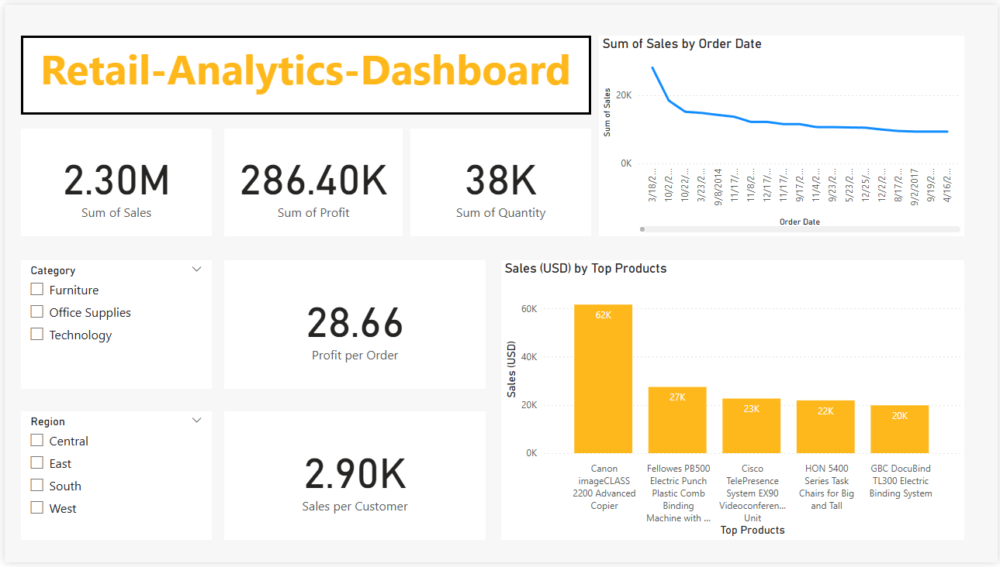

# 📊 Retail Analytics Dashboard - Power BI



## 🔍 Project Overview
An interactive dashboard analyzing sales performance with:
- **Key Metrics**: Avg Profit per Order, Sales per Customer (DAX measures)
- **Top 5 Products**: Contributing **[X]%** of total revenue
- **Dynamic Filters**: Region, Category, and time-period slicers

## 🛠️ Technical Details
- **Tools**: Power BI (DAX, Data Modeling, Interactive Visuals)
- **Dataset**: [Kaggle Superstore Data](https://www.kaggle.com/datasets/vivek468/superstore-dataset-final) (Public)
- **DAX Measures**:
  ```dax
  Avg Profit per Order = DIVIDE(SUM('Orders'[Profit]), COUNTROWS('Orders'), 0)
  Sales per Customer = DIVIDE(SUM('Orders'[Sales]), DISTINCTCOUNT('Orders'[Customer ID]), 0)
  ```

## 📂 How to Use
1. Download `Retail_Analytics_Dashboard.pbix`.
2. Open in [Power BI Desktop](https://powerbi.microsoft.com/en-us/desktop/).
3. Interact with filters to explore trends.

## 💡 Key Insights
- **Top 5 products** drive **[X]%** of total sales.
- **Avg profit per order**: $28.66  
- **Sales per customer**: $2.90
